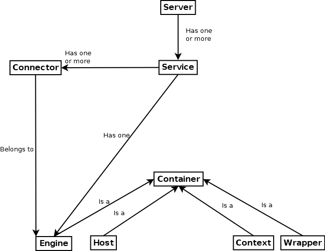
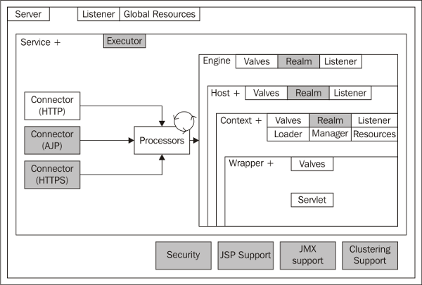
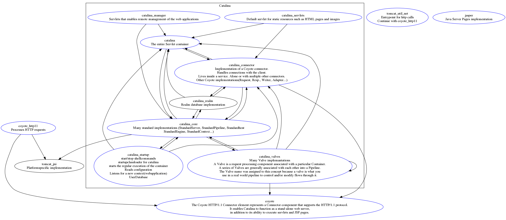
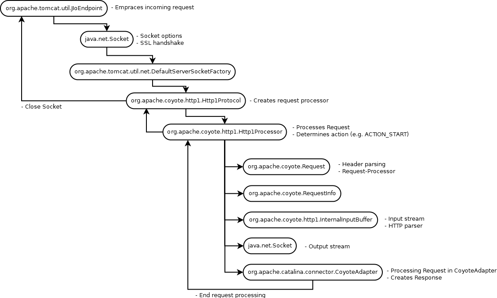

# Apache Tomcat Architecture

## Table of Contents

1. [Rough Architecture](#rough-architecture)
   1. [Server](#server)
   2. [Service](#service)
   3. [Engine](#engine)
   4. [Host](#host)
   5. [Connector](#connector)
   6. [Context](#context)
2. [Important packages](#important-packages)
3. [Important Interfaces and Classes](#important-interfaces-and-classes)
   1. [Server Interface](#server-interface)
   2. [Service Interface](#service-interface)
   3. [Engine Interface](#engine-interface)
   4. [Host Interface](#host-interface)
   5. [Connector Interface](#connector-interface)
   6. [Context Interface](#context-interface)
   7. [Wrapper Interface](#wrapper-interface)
   8. [container Interface](#container-interface)
   9. [Realm Class](#realm-class)
   10. [Pipeline Classs](#pipeline-class)
   11. [Valve Class](#valve-class)
   12. [Lifecycle Class](#lifecycle-class)
4. [Generated package structure](#generated-package-structure)
5. [Architecture Overview](#architecture-overview)
6. [Processing a Request](#processing-a-request)
   1. [Extracting classes involved in one http call](#extracting-classes-involved-in-one-http-call)
   2. [Extracting packages involved in one http call](#extracting-packages-involved-in-one-http-call)
   3. [Function calls sorted by package](#function-calls-sorted-by-package)
   4. [Function calls sorted by amount of calls in a descending order](#function-calls-sorted-by-amount-of-calls-in-a-descending-order)
   5. [Rough Request process](#rough-request-process)
7. [Misc](#misc)

## Rough Architecture

---



---

### Server:
- Server Container
- Can have one or more services

### Service:
- Lives inside a server
- Ties one or more connectors to one engine
- Belongs to one server
- Can have one or more connectors
- Can have one Engine

### Engine:
- Processes requests for it’s services
- Receives and processes requests taken from the connectors
- Creates responses and handles them back to the connectors
- Belongs to one service
- Can have one or more hosts
- Has one or more connectors

### Host:
- Association of network name (hs-mannheim.de) to Tomcat server
- Belongs to one engine
- Can have one or more contexts

### Connector:
- Handles communications with clients
- HTTP-Connector for HTTP-traffic
- AJP-Connector to connect to e.g. HTTPD
- Belongs to one service
- Belongs to one engine

### Context:
- Unique web application with unique path
- Belongs to one host


## Important packages

In this section all important features for 


### catalina
- Contains fundamental packages of the Tomcat server
- Subpackage “core” contains all the important interfaces and classes that make out the

### server’s structure
- Subpackage “connector” contains classes that implement the Connector interface

### coyote
- Contains important components for the HTTP1-connector
   - Listens for TCP connections and forwards requests to Tomcat’s JSP-Engine

### jk
- Contains components for Tomcat’s JK-connector
  - Allows Tomcat to connect to a Webserver like IIS via jk protocol

### jasper
- Contains the components of Tomcat’s JSP-Engine


## Important Interfaces and Classes


### Server Interface:

**Included in org.apache.catalina**

- Interface
- Represents the Tomcat server
- Implementing class:
  - StandardServer (org.apache.catalina.core)

### Service Interface:

**Included in org.apache.catalina**

- Interface
- Group of connectors that share a container (engine) for request processing
- Implementing class:
  - StandardService (org.apache.catalina.core)
    - Parent of Embedded
  - Embedded (org.apache.catalina.startup)
    - Convenience class to embed Catalina servlet inside another web application
    - After proper initialisation one can add connectors, engines, hosts and contexts on the fly
  - Catalina (org.apache.catalina.startup)
    - Startup/Shutdown shell program for Catalina servlet

### Engine Interface:

**Included in org.apache.catalina**

- Interface
- Useful for these scenarios:
  - Use of interceptors to see every single request processes
  - Running Catalina with a standalone HTTP-connector
- Implementing classes:
  - StandardEngine (org.apache.catalina.core)
- Container
  - Child-container is host-implementation

### Host Interface:

**Included in org.apache.catalina.core**

- Virtual host in Catalina servlet engine
- Implementing classes:
  - StandardHost
- Container
  - Parent-container is engine-implementation
  - Child-container is context-implementation

### Connector Interface:

**Included in org.apache.connector**

- Coyote connector

### Context Interface:

**Included in org.apache.catalina**

- A web application in Catalina servlet engine
- Use of interceptor to see all requests for a context possible
- Implementing classes:
  - StandardContext (org.apache.catalina.core)
- Container:
  - Parent-Container = Host
  - Child-Container = Wrapper


**NOTE: Engines and hosts aren’t generally used when a Catalina is deployed which is connected to a
Webserver like Apache because the connector then utilizes the webserver’s facilities to determine the
proper context for processing the request.**


### Wrapper Interfaces:

**Included in org.apache.catalina.core**

- Individual servlet definition
- Interceptor to see requests for servlets
- Manages servlet life cycle for underlying class (e.g. init() and destroy())
- Container:
  - Can have wrapper implementations as child-container
- Implementing classes:
  - StandardWrapper (org.apache.catalina.core)

### Container Interface:

**Included in org.apache.catalina**

- Interface
- Executes requests and creates/returns a response. Alternative: support pipeline of valves for processing
- Possible containers:
  - Engine: Catalina servlet engine, can have hosts or contexts as child-containers
  - Host: Virtual host, can have context as child-containers
  - Context: SingleServlet context, can have Wrapper as child-containers
  - Wrapper: Individual servlet definition, can have wrapper as child-containers
- Implementing classes:
  - ContainerBase (org.apache.catalina.core)
    - “Standard”-classes extend this class to get common functionalities

### Realm:

**Included in org.apache.catalina**

- Read-only facade for security realm
- Authenticate users and their security roles
- Attached at any container level (mostly context or higher)

### Pipeline:

**Included in org.apache.catalina**

- Collection of valves to be executed in order when invoke() is called
- A valve must process a request and create a proper responses
- One pipeline for each Container

### Valve:

**Included in org.apache.catalina**

- Request-processing component associated with its container

### Lifecycle:

**Included in org.apache.catalina**

- Interface for component lifecycle methods
- Not mandatory for Catalina components
- Provides consistent mechanism to start and shutdown component

## Generated package structure


## Architecture Overview

---



---

**NOTE: Blue packages are important**

## Processing a Request

You can find the profiled method calls of one http request in the [cpu-live.csv](./files/cpu-live.csv) file.
It was extraced with the tool *jvisualvm* what you can find in the JDK folder.

### Extracting classes involved in one http call
```shell
grep "^" cpu-live.csv | sed -E "s;^\"([^(]*)\..*\..*;\1;g" | sort | uniq
```

> org.apache.catalina.connector.Connector
org.apache.catalina.connector.CoyoteAdapter
org.apache.catalina.connector.CoyoteWriter
org.apache.catalina.connector.InputBuffer
org.apache.catalina.connector.OutputBuffer
org.apache.catalina.connector.Request
org.apache.catalina.connector.RequestFacade
org.apache.catalina.connector.Response
org.apache.catalina.core.ApplicationFilterChain
org.apache.catalina.core.ApplicationFilterFactory
org.apache.catalina.core.StandardContextValve
org.apache.catalina.core.StandardEngineValve
org.apache.catalina.core.StandardHostValve
org.apache.catalina.core.StandardPipeline
org.apache.catalina.core.StandardWrapper
org.apache.catalina.core.StandardWrapperValve
org.apache.catalina.util.InstanceSupport
org.apache.catalina.util.ParameterMap
org.apache.catalina.util.RequestUtil
org.apache.catalina.valves.ErrorReportValve
org.apache.coyote.http11.filters.IdentityOutputFilter
org.apache.coyote.http11.Http11Processor
org.apache.coyote.http11.InternalOutputBuffer
org.apache.coyote.Request
org.apache.coyote.Response
org.apache.juli.logging.DirectJDKLog
org.apache.naming.resources.BaseDirContext
org.apache.naming.resources.FileDirContext
org.apache.naming.resources.FileDirContext$FileResourceAttributes
org.apache.naming.resources.ProxyDirContext
org.apache.naming.resources.ResourceAttributes
org.apache.naming.resources.ResourceCache
org.apache.tomcat.util.buf.Ascii
org.apache.tomcat.util.buf.ByteChunk
org.apache.tomcat.util.buf.CharChunk
org.apache.tomcat.util.buf.MessageBytes
org.apache.tomcat.util.buf.StringCache
org.apache.tomcat.util.buf.StringCache$ByteEntry
org.apache.tomcat.util.buf.UDecoder
org.apache.tomcat.util.http.Cookies
org.apache.tomcat.util.http.FastHttpDateFormat
org.apache.tomcat.util.http.HttpMessages
org.apache.tomcat.util.http.mapper.Mapper
org.apache.tomcat.util.http.mapper.MappingData
org.apache.tomcat.util.http.MimeHeaders
org.apache.tomcat.util.log.SystemLogHandler
org.apache.tomcat.util.res.StringManager

### Extracting packages involved in one http call
```shell
grep "^" cpu-live.csv | sed -E "s;^\"([^A-Z]*)\..*;\1;g" | sort | uniq
```

> org.apache.catalina.connector
org.apache.catalina.core
org.apache.catalina.util
org.apache.catalina.valves
org.apache.coyote
org.apache.coyote.http11
org.apache.coyote.http11.filters
org.apache.juli.logging
org.apache.naming.resources
org.apache.tomcat.util.buf
org.apache.tomcat.util.http
org.apache.tomcat.util.http.mapper
org.apache.tomcat.util.log
org.apache.tomcat.util.res

### Function calls sorted by package
```shell
grep "^" cpu-live.csv | sed -E "s;^\"([^\"]*).*;\1;g" | sort | uniq
```

> org.apache.catalina.connector.Connector.getContainer()
org.apache.catalina.connector.CoyoteAdapter.checkNormalize(org.apache.tomcat.util.buf.MessageBytes)
org.apache.catalina.connector.CoyoteAdapter.convertURI(org.apache.tomcat.util.buf.MessageBytes, org.apache.catalina.connector.Request)
org.apache.catalina.connector.CoyoteAdapter.normalize(org.apache.tomcat.util.buf.MessageBytes)
org.apache.catalina.connector.CoyoteAdapter.parsePathParameters(org.apache.coyote.Request, org.apache.catalina.connector.Request)
org.apache.catalina.connector.CoyoteAdapter.parseSessionCookiesId(org.apache.coyote.Request, org.apache.catalina.connector.Request)
org.apache.catalina.connector.CoyoteAdapter.postParseRequest(org.apache.coyote.Request, org.apache.catalina.connector.Request, org.apache.coyote.Response, org.apache.catalina.connector.Response)
org.apache.catalina.connector.CoyoteAdapter.service(org.apache.coyote.Request, org.apache.coyote.Response)
org.apache.catalina.connector.CoyoteWriter.recycle()
org.apache.catalina.connector.InputBuffer.close()
org.apache.catalina.connector.InputBuffer.recycle()
org.apache.catalina.connector.OutputBuffer.close()
org.apache.catalina.connector.OutputBuffer.doFlush(boolean)
org.apache.catalina.connector.OutputBuffer.recycle()
org.apache.catalina.connector.RequestFacade.getAttribute(String)
org.apache.catalina.connector.Request.getAttribute(String)
org.apache.catalina.connector.Request.getHost()
org.apache.catalina.connector.Request.getPathParameter(String)
org.apache.catalina.connector.Request.getRequest()
org.apache.catalina.connector.Request.getRequestPathMB()
org.apache.catalina.connector.Request.isSSLAttribute(String)
org.apache.catalina.connector.Request.recycle()
org.apache.catalina.connector.Request.removeAttribute(String)
org.apache.catalina.connector.Request.setAttribute(String, Object)
org.apache.catalina.connector.Response.finishResponse()
org.apache.catalina.connector.Response.getResponse()
org.apache.catalina.connector.Response.getStatus()
org.apache.catalina.connector.Response.isCommitted()
org.apache.catalina.connector.Response.recycle()
org.apache.catalina.connector.Response.sendAcknowledgement()
org.apache.catalina.connector.Response.setSuspended(boolean)
org.apache.catalina.core.ApplicationFilterChain.doFilter(javax.servlet.ServletRequest, javax.servlet.ServletResponse)
org.apache.catalina.core.ApplicationFilterChain.internalDoFilter(javax.servlet.ServletRequest, javax.servlet.ServletResponse)
org.apache.catalina.core.ApplicationFilterChain.release()
org.apache.catalina.core.ApplicationFilterFactory.createFilterChain(javax.servlet.ServletRequest, org.apache.catalina.Wrapper, javax.servlet.Servlet)
org.apache.catalina.core.ApplicationFilterFactory.getInstance()
org.apache.catalina.core.StandardContextValve.invoke(org.apache.catalina.connector.Request, org.apache.catalina.connector.Response)
org.apache.catalina.core.StandardEngineValve.invoke(org.apache.catalina.connector.Request, org.apache.catalina.connector.Response)
org.apache.catalina.core.StandardHostValve.invoke(org.apache.catalina.connector.Request, org.apache.catalina.connector.Response)
org.apache.catalina.core.StandardHostValve.status(org.apache.catalina.connector.Request, org.apache.catalina.connector.Response)
org.apache.catalina.core.StandardPipeline.getFirst()
org.apache.catalina.core.StandardWrapper.allocate()
org.apache.catalina.core.StandardWrapper.deallocate(javax.servlet.Servlet)
org.apache.catalina.core.StandardWrapper.isUnavailable()
org.apache.catalina.core.StandardWrapperValve.invoke(org.apache.catalina.connector.Request, org.apache.catalina.connector.Response)
org.apache.catalina.util.InstanceSupport.fireInstanceEvent(String, javax.servlet.Servlet, javax.servlet.ServletRequest, javax.servlet.ServletResponse)
org.apache.catalina.util.ParameterMap.clear()
org.apache.catalina.util.RequestUtil.normalize(String, boolean)
org.apache.catalina.valves.ErrorReportValve.invoke(org.apache.catalina.connector.Request, org.apache.catalina.connector.Response)
org.apache.catalina.valves.ErrorReportValve.report(org.apache.catalina.connector.Request, org.apache.catalina.connector.Response, Throwable)
org.apache.coyote.http11.filters.IdentityOutputFilter.end()
org.apache.coyote.http11.filters.IdentityOutputFilter.setResponse(org.apache.coyote.Response)
org.apache.coyote.http11.Http11Processor.action(org.apache.coyote.ActionCode, Object)
org.apache.coyote.http11.Http11Processor.prepareResponse()
org.apache.coyote.http11.Http11Processor.statusDropsConnection(int)
org.apache.coyote.http11.InternalOutputBuffer.addActiveFilter(org.apache.coyote.http11.OutputFilter)
org.apache.coyote.http11.InternalOutputBuffer.commit()
org.apache.coyote.http11.InternalOutputBuffer.endHeaders()
org.apache.coyote.http11.InternalOutputBuffer.endRequest()
org.apache.coyote.http11.InternalOutputBuffer.realWriteBytes(byte[], int, int)
org.apache.coyote.http11.InternalOutputBuffer.sendHeader(org.apache.tomcat.util.buf.MessageBytes, org.apache.tomcat.util.buf.MessageBytes)
org.apache.coyote.http11.InternalOutputBuffer.sendStatus()
org.apache.coyote.http11.InternalOutputBuffer.write(byte[])
org.apache.coyote.http11.InternalOutputBuffer.write(int)
org.apache.coyote.http11.InternalOutputBuffer.write(org.apache.tomcat.util.buf.MessageBytes)
org.apache.coyote.http11.InternalOutputBuffer.write(String)
org.apache.coyote.Request.action(org.apache.coyote.ActionCode, Object)
org.apache.coyote.Request.getAttribute(String)
org.apache.coyote.Request.getNote(int)
org.apache.coyote.Response.acknowledge()
org.apache.coyote.Response.action(org.apache.coyote.ActionCode, Object)
org.apache.coyote.Response.finish()
org.apache.coyote.Response.getNote(int)
org.apache.coyote.Response.sendHeaders()
org.apache.coyote.Response.setContentLength(int)
org.apache.juli.logging.DirectJDKLog.isDebugEnabled()
org.apache.juli.logging.DirectJDKLog.isTraceEnabled()
org.apache.naming.resources.BaseDirContext.getAttributes(String)
org.apache.naming.resources.FileDirContext$FileResourceAttributes.getContentLength()
org.apache.naming.resources.FileDirContext$FileResourceAttributes.getCreation()
org.apache.naming.resources.FileDirContext$FileResourceAttributes.getLastModified()
org.apache.naming.resources.FileDirContext$FileResourceAttributes.<init>(org.apache.naming.resources.FileDirContext, java.io.File)
org.apache.naming.resources.FileDirContext.file(String)
org.apache.naming.resources.FileDirContext.getAttributes(String, String[])
org.apache.naming.resources.FileDirContext.normalize(String)
org.apache.naming.resources.ProxyDirContext.cacheLookup(String)
org.apache.naming.resources.ProxyDirContext.lookup(String)
org.apache.naming.resources.ProxyDirContext.revalidate(org.apache.naming.resources.CacheEntry)
org.apache.naming.resources.ProxyDirContext.validate(org.apache.naming.resources.CacheEntry)
org.apache.naming.resources.ResourceAttributes.<init>()
org.apache.naming.resources.ResourceCache.find(org.apache.naming.resources.CacheEntry[], String)
org.apache.naming.resources.ResourceCache.lookup(String)
org.apache.tomcat.util.buf.Ascii.toLower(int)
org.apache.tomcat.util.buf.ByteChunk.allocate(int, int)
org.apache.tomcat.util.buf.ByteChunk.append(byte[], int, int)
org.apache.tomcat.util.buf.ByteChunk.append(org.apache.tomcat.util.buf.ByteChunk)
org.apache.tomcat.util.buf.ByteChunk.equalsIgnoreCase(String)
org.apache.tomcat.util.buf.ByteChunk.flushBuffer()
org.apache.tomcat.util.buf.ByteChunk.getBytes()
org.apache.tomcat.util.buf.ByteChunk.getCharset()
org.apache.tomcat.util.buf.ByteChunk.getLength()
org.apache.tomcat.util.buf.ByteChunk.indexOf(byte[], int, int, char)
org.apache.tomcat.util.buf.ByteChunk.indexOf(char, int)
org.apache.tomcat.util.buf.ByteChunk.indexOf(String, int, int, int)
org.apache.tomcat.util.buf.ByteChunk.isNull()
org.apache.tomcat.util.buf.ByteChunk.makeSpace(int)
org.apache.tomcat.util.buf.ByteChunk.recycle()
org.apache.tomcat.util.buf.ByteChunk.toString()
org.apache.tomcat.util.buf.ByteChunk.toStringInternal()
org.apache.tomcat.util.buf.CharChunk.allocate(int, int)
org.apache.tomcat.util.buf.CharChunk.equalsIgnoreCase(String)
org.apache.tomcat.util.buf.CharChunk.getChars()
org.apache.tomcat.util.buf.CharChunk.getLength()
org.apache.tomcat.util.buf.CharChunk.indexOf(String, int, int, int)
org.apache.tomcat.util.buf.CharChunk.isNull()
org.apache.tomcat.util.buf.CharChunk.recycle()
org.apache.tomcat.util.buf.CharChunk.setChars(char[], int, int)
org.apache.tomcat.util.buf.CharChunk.startsWith(String)
org.apache.tomcat.util.buf.CharChunk.toString()
org.apache.tomcat.util.buf.CharChunk.toStringInternal()
org.apache.tomcat.util.buf.MessageBytes.duplicate(org.apache.tomcat.util.buf.MessageBytes)
org.apache.tomcat.util.buf.MessageBytes.equalsIgnoreCase(String)
org.apache.tomcat.util.buf.MessageBytes.equals(String)
org.apache.tomcat.util.buf.MessageBytes.getCharset()
org.apache.tomcat.util.buf.MessageBytes.isNull()
org.apache.tomcat.util.buf.MessageBytes.recycle()
org.apache.tomcat.util.buf.MessageBytes.setChars(char[], int, int)
org.apache.tomcat.util.buf.MessageBytes.setCharset(java.nio.charset.Charset)
org.apache.tomcat.util.buf.MessageBytes.setString(String)
org.apache.tomcat.util.buf.MessageBytes.startsWithIgnoreCase(String, int)
org.apache.tomcat.util.buf.MessageBytes.toBytes()
org.apache.tomcat.util.buf.MessageBytes.toChars()
org.apache.tomcat.util.buf.MessageBytes.toString()
org.apache.tomcat.util.buf.StringCache$ByteEntry.<init>()
org.apache.tomcat.util.buf.StringCache.toString(org.apache.tomcat.util.buf.ByteChunk)
org.apache.tomcat.util.buf.StringCache.toString(org.apache.tomcat.util.buf.CharChunk)
org.apache.tomcat.util.buf.UDecoder.convert(org.apache.tomcat.util.buf.ByteChunk, boolean)
org.apache.tomcat.util.buf.UDecoder.convert(org.apache.tomcat.util.buf.MessageBytes, boolean)
org.apache.tomcat.util.http.Cookies.getCookieCount()
org.apache.tomcat.util.http.Cookies.processCookies(org.apache.tomcat.util.http.MimeHeaders)
org.apache.tomcat.util.http.FastHttpDateFormat.getCurrentDate()
org.apache.tomcat.util.http.HttpMessages.getMessage(int)
org.apache.tomcat.util.http.mapper.Mapper.compareIgnoreCase(org.apache.tomcat.util.buf.CharChunk, int, int, String)
org.apache.tomcat.util.http.mapper.Mapper.compare(org.apache.tomcat.util.buf.CharChunk, int, int, String)
org.apache.tomcat.util.http.mapper.Mapper.findIgnoreCase(org.apache.tomcat.util.http.mapper.Mapper.MapElement[], org.apache.tomcat.util.buf.CharChunk)
org.apache.tomcat.util.http.mapper.Mapper.findIgnoreCase(org.apache.tomcat.util.http.mapper.Mapper.MapElement[], org.apache.tomcat.util.buf.CharChunk, int, int)
org.apache.tomcat.util.http.mapper.Mapper.find(org.apache.tomcat.util.http.mapper.Mapper.MapElement[], org.apache.tomcat.util.buf.CharChunk)
org.apache.tomcat.util.http.mapper.Mapper.find(org.apache.tomcat.util.http.mapper.Mapper.MapElement[], org.apache.tomcat.util.buf.CharChunk, int, int)
org.apache.tomcat.util.http.mapper.Mapper.internalMapExactWrapper(org.apache.tomcat.util.http.mapper.Mapper.Wrapper[], org.apache.tomcat.util.buf.CharChunk, org.apache.tomcat.util.http.mapper.MappingData)
org.apache.tomcat.util.http.mapper.Mapper.internalMapExtensionWrapper(org.apache.tomcat.util.http.mapper.Mapper.Wrapper[], org.apache.tomcat.util.buf.CharChunk, org.apache.tomcat.util.http.mapper.MappingData)
org.apache.tomcat.util.http.mapper.Mapper.internalMap(org.apache.tomcat.util.buf.CharChunk, org.apache.tomcat.util.buf.CharChunk, org.apache.tomcat.util.http.mapper.MappingData)
org.apache.tomcat.util.http.mapper.Mapper.internalMapWildcardWrapper(org.apache.tomcat.util.http.mapper.Mapper.Wrapper[], int, org.apache.tomcat.util.buf.CharChunk, org.apache.tomcat.util.http.mapper.MappingData)
org.apache.tomcat.util.http.mapper.Mapper.internalMapWrapper(org.apache.tomcat.util.http.mapper.Mapper.Context, org.apache.tomcat.util.buf.CharChunk, org.apache.tomcat.util.http.mapper.MappingData)
org.apache.tomcat.util.http.mapper.Mapper.lastSlash(org.apache.tomcat.util.buf.CharChunk)
org.apache.tomcat.util.http.mapper.Mapper.map(org.apache.tomcat.util.buf.MessageBytes, org.apache.tomcat.util.buf.MessageBytes, org.apache.tomcat.util.http.mapper.MappingData)
org.apache.tomcat.util.http.mapper.Mapper.nthSlash(org.apache.tomcat.util.buf.CharChunk, int)
org.apache.tomcat.util.http.mapper.MappingData.recycle()
org.apache.tomcat.util.http.MimeHeaders.createHeader()

### Function calls sorted by amount of calls in a descending order
```shell
grep "^" cpu-live.csv | sed -E "s;^\"([^\"]*).*;\1;g"
```

> org.apache.catalina.connector.CoyoteAdapter.postParseRequest(org.apache.coyote.Request, org.apache.catalina.connector.Request, org.apache.coyote.Response, org.apache.catalina.connector.Response)
org.apache.coyote.http11.Http11Processor.prepareResponse()
org.apache.catalina.core.ApplicationFilterChain.internalDoFilter(javax.servlet.ServletRequest, javax.servlet.ServletResponse)
org.apache.naming.resources.FileDirContext.file(String)
org.apache.catalina.core.StandardWrapperValve.invoke(org.apache.catalina.connector.Request, org.apache.catalina.connector.Response)
org.apache.catalina.connector.CoyoteAdapter.service(org.apache.coyote.Request, org.apache.coyote.Response)
org.apache.catalina.connector.Request.getAttribute(String)
org.apache.tomcat.util.buf.StringCache.toString(org.apache.tomcat.util.buf.ByteChunk)
org.apache.catalina.connector.OutputBuffer.close()
org.apache.tomcat.util.http.FastHttpDateFormat.getCurrentDate()
org.apache.tomcat.util.buf.ByteChunk.toStringInternal()
org.apache.catalina.core.StandardContextValve.invoke(org.apache.catalina.connector.Request, org.apache.catalina.connector.Response)
org.apache.tomcat.util.log.SystemLogHandler.println(String)
org.apache.tomcat.util.buf.MessageBytes.equalsIgnoreCase(String)
org.apache.coyote.http11.InternalOutputBuffer.sendStatus()
org.apache.catalina.connector.CoyoteAdapter.parsePathParameters(org.apache.coyote.Request, org.apache.catalina.connector.Request)
org.apache.tomcat.util.http.mapper.Mapper.internalMapWrapper(org.apache.tomcat.util.http.mapper.Mapper.Context, org.apache.tomcat.util.buf.CharChunk, org.apache.tomcat.util.http.mapper.MappingData)
org.apache.catalina.core.StandardHostValve.invoke(org.apache.catalina.connector.Request, org.apache.catalina.connector.Response)
org.apache.catalina.connector.Request.recycle()
org.apache.tomcat.util.http.mapper.Mapper.internalMap(org.apache.tomcat.util.buf.CharChunk, org.apache.tomcat.util.buf.CharChunk, org.apache.tomcat.util.http.mapper.MappingData)
org.apache.catalina.core.ApplicationFilterFactory.createFilterChain(javax.servlet.ServletRequest, org.apache.catalina.Wrapper, javax.servlet.Servlet)
org.apache.catalina.connector.Request.getPathParameter(String)
org.apache.naming.resources.ProxyDirContext.revalidate(org.apache.naming.resources.CacheEntry)
org.apache.naming.resources.ProxyDirContext.cacheLookup(String)
org.apache.catalina.valves.ErrorReportValve.invoke(org.apache.catalina.connector.Request, org.apache.catalina.connector.Response)
org.apache.catalina.connector.Request.isSSLAttribute(String)
org.apache.naming.resources.FileDirContext$FileResourceAttributes.getLastModified()
org.apache.coyote.http11.Http11Processor.action(org.apache.coyote.ActionCode, Object)
org.apache.coyote.http11.InternalOutputBuffer.addActiveFilter(org.apache.coyote.http11.OutputFilter)
org.apache.tomcat.util.buf.ByteChunk.equalsIgnoreCase(String)
org.apache.tomcat.util.buf.MessageBytes.duplicate(org.apache.tomcat.util.buf.MessageBytes)
org.apache.tomcat.util.buf.MessageBytes.isNull()
org.apache.catalina.connector.Response.isCommitted()
org.apache.catalina.connector.CoyoteAdapter.convertURI(org.apache.tomcat.util.buf.MessageBytes, org.apache.catalina.connector.Request)
org.apache.tomcat.util.buf.ByteChunk.append(byte[], int, int)
org.apache.catalina.connector.Response.recycle()
org.apache.catalina.connector.Response.sendAcknowledgement()
org.apache.tomcat.util.http.HttpMessages.getMessage(int)
org.apache.coyote.Response.action(org.apache.coyote.ActionCode, Object)
org.apache.catalina.connector.InputBuffer.recycle()
org.apache.coyote.http11.InternalOutputBuffer.write(byte[])
org.apache.tomcat.util.http.MimeHeaders.setValue(String)
org.apache.catalina.core.StandardHostValve.status(org.apache.catalina.connector.Request, org.apache.catalina.connector.Response)
org.apache.catalina.connector.Request.removeAttribute(String)
org.apache.coyote.http11.InternalOutputBuffer.endRequest()
org.apache.tomcat.util.buf.MessageBytes.equals(String)
org.apache.catalina.core.StandardWrapper.allocate()
org.apache.tomcat.util.http.mapper.Mapper.find(org.apache.tomcat.util.http.mapper.Mapper.MapElement[], org.apache.tomcat.util.buf.CharChunk)
org.apache.catalina.connector.CoyoteAdapter.parseSessionCookiesId(org.apache.coyote.Request, org.apache.catalina.connector.Request)
org.apache.coyote.http11.InternalOutputBuffer.write(int)
org.apache.naming.resources.FileDirContext$FileResourceAttributes.<init>(org.apache.naming.resources.FileDirContext, java.io.File)
org.apache.tomcat.util.http.mapper.Mapper.find(org.apache.tomcat.util.http.mapper.Mapper.MapElement[], org.apache.tomcat.util.buf.CharChunk, int, int)
org.apache.tomcat.util.http.mapper.Mapper.compareIgnoreCase(org.apache.tomcat.util.buf.CharChunk, int, int, String)
org.apache.tomcat.util.buf.UDecoder.convert(org.apache.tomcat.util.buf.MessageBytes, boolean)
org.apache.tomcat.util.buf.UDecoder.convert(org.apache.tomcat.util.buf.ByteChunk, boolean)
org.apache.catalina.connector.CoyoteAdapter.checkNormalize(org.apache.tomcat.util.buf.MessageBytes)
org.apache.catalina.core.StandardEngineValve.invoke(org.apache.catalina.connector.Request, org.apache.catalina.connector.Response)
org.apache.naming.resources.ResourceCache.lookup(String)
org.apache.catalina.connector.Response.getStatus()
org.apache.tomcat.util.buf.MessageBytes.setChars(char[], int, int)
org.apache.catalina.connector.CoyoteAdapter.normalize(org.apache.tomcat.util.buf.MessageBytes)
org.apache.tomcat.util.http.mapper.Mapper.map(org.apache.tomcat.util.buf.MessageBytes, org.apache.tomcat.util.buf.MessageBytes, org.apache.tomcat.util.http.mapper.MappingData)
org.apache.tomcat.util.res.StringManager.getString(String)
org.apache.tomcat.util.buf.ByteChunk.getBytes()
org.apache.coyote.http11.InternalOutputBuffer.write(org.apache.tomcat.util.buf.MessageBytes)
org.apache.tomcat.util.buf.ByteChunk.toString()
org.apache.tomcat.util.buf.MessageBytes.toBytes()
org.apache.tomcat.util.log.SystemLogHandler.findStream()
org.apache.tomcat.util.http.mapper.Mapper.findIgnoreCase(org.apache.tomcat.util.http.mapper.Mapper.MapElement[], org.apache.tomcat.util.buf.CharChunk)
org.apache.catalina.connector.Request.getHost()
org.apache.coyote.Response.acknowledge()
org.apache.catalina.util.RequestUtil.normalize(String, boolean)
org.apache.coyote.http11.InternalOutputBuffer.commit()
org.apache.tomcat.util.buf.MessageBytes.getCharset()
org.apache.catalina.connector.OutputBuffer.doFlush(boolean)
org.apache.tomcat.util.buf.ByteChunk.indexOf(char, int)
org.apache.tomcat.util.buf.CharChunk.getChars()
org.apache.coyote.http11.InternalOutputBuffer.write(String)
org.apache.naming.resources.ProxyDirContext.validate(org.apache.naming.resources.CacheEntry)
org.apache.tomcat.util.buf.ByteChunk.append(org.apache.tomcat.util.buf.ByteChunk)
org.apache.tomcat.util.http.mapper.Mapper.compare(org.apache.tomcat.util.buf.CharChunk, int, int, String)
org.apache.catalina.connector.OutputBuffer.recycle()
org.apache.naming.resources.FileDirContext.getAttributes(String, String[])
org.apache.catalina.connector.Response.finishResponse()
org.apache.tomcat.util.buf.CharChunk.toString()
org.apache.coyote.http11.InternalOutputBuffer.realWriteBytes(byte[], int, int)
org.apache.tomcat.util.buf.StringCache.toString(org.apache.tomcat.util.buf.CharChunk)
org.apache.catalina.core.ApplicationFilterChain.doFilter(javax.servlet.ServletRequest, javax.servlet.ServletResponse)
org.apache.tomcat.util.http.Cookies.getCookieCount()
org.apache.tomcat.util.buf.ByteChunk.isNull()
org.apache.tomcat.util.buf.MessageBytes.startsWithIgnoreCase(String, int)
org.apache.tomcat.util.buf.ByteChunk.getLength()
org.apache.tomcat.util.buf.ByteChunk.makeSpace(int)
org.apache.juli.logging.DirectJDKLog.isTraceEnabled()
org.apache.tomcat.util.buf.Ascii.toLower(int)
org.apache.coyote.http11.InternalOutputBuffer.sendHeader(org.apache.tomcat.util.buf.MessageBytes, org.apache.tomcat.util.buf.MessageBytes)
org.apache.naming.resources.ResourceAttributes.<init>()
org.apache.tomcat.util.http.MimeHeaders.getValue(String)
org.apache.catalina.connector.Request.getRequestPathMB()
org.apache.tomcat.util.http.mapper.Mapper.findIgnoreCase(org.apache.tomcat.util.http.mapper.Mapper.MapElement[], org.apache.tomcat.util.buf.CharChunk, int, int)
org.apache.tomcat.util.http.Cookies.processCookies(org.apache.tomcat.util.http.MimeHeaders)
org.apache.catalina.valves.ErrorReportValve.report(org.apache.catalina.connector.Request, org.apache.catalina.connector.Response, Throwable)
org.apache.juli.logging.DirectJDKLog.isDebugEnabled()
org.apache.naming.resources.ResourceCache.find(org.apache.naming.resources.CacheEntry[], String)
org.apache.tomcat.util.buf.MessageBytes.setString(String)
org.apache.naming.resources.FileDirContext$FileResourceAttributes.getContentLength()
org.apache.naming.resources.BaseDirContext.getAttributes(String)
org.apache.tomcat.util.buf.CharChunk.indexOf(String, int, int, int)
org.apache.naming.resources.FileDirContext.normalize(String)
org.apache.tomcat.util.http.MimeHeaders.createHeader()
org.apache.tomcat.util.http.MimeHeaders.findHeader(String, int)
org.apache.tomcat.util.buf.CharChunk.toStringInternal()
org.apache.naming.resources.ProxyDirContext.lookup(String)
org.apache.tomcat.util.buf.CharChunk.setChars(char[], int, int)
org.apache.catalina.connector.Request.setAttribute(String, Object)
org.apache.catalina.core.StandardWrapper.deallocate(javax.servlet.Servlet)
org.apache.tomcat.util.buf.ByteChunk.getCharset()
org.apache.tomcat.util.buf.MessageBytes.toString()
org.apache.tomcat.util.buf.StringCache$ByteEntry.<init>()
org.apache.catalina.core.StandardWrapper.isUnavailable()
org.apache.tomcat.util.buf.ByteChunk.flushBuffer()
org.apache.tomcat.util.http.mapper.Mapper.internalMapExtensionWrapper(org.apache.tomcat.util.http.mapper.Mapper.Wrapper[], org.apache.tomcat.util.buf.CharChunk, org.apache.tomcat.util.http.mapper.MappingData)
org.apache.tomcat.util.buf.CharChunk.equalsIgnoreCase(String)
org.apache.coyote.Request.getNote(int)
org.apache.coyote.Request.action(org.apache.coyote.ActionCode, Object)
org.apache.tomcat.util.http.mapper.MappingData.recycle()
org.apache.catalina.connector.Response.setSuspended(boolean)
org.apache.tomcat.util.http.mapper.Mapper.internalMapExactWrapper(org.apache.tomcat.util.http.mapper.Mapper.Wrapper[], org.apache.tomcat.util.buf.CharChunk, org.apache.tomcat.util.http.mapper.MappingData)
org.apache.naming.resources.FileDirContext$FileResourceAttributes.getCreation()
org.apache.tomcat.util.buf.CharChunk.isNull()
org.apache.catalina.core.ApplicationFilterFactory.getInstance()
org.apache.coyote.http11.filters.IdentityOutputFilter.end()
org.apache.tomcat.util.buf.ByteChunk.indexOf(byte[], int, int, char)
org.apache.tomcat.util.buf.ByteChunk.recycle()
org.apache.coyote.Request.getAttribute(String)
org.apache.coyote.Response.sendHeaders()
org.apache.tomcat.util.buf.MessageBytes.recycle()
org.apache.coyote.Response.finish()
org.apache.catalina.connector.Connector.getContainer()
org.apache.coyote.http11.filters.IdentityOutputFilter.setResponse(org.apache.coyote.Response)
org.apache.tomcat.util.buf.CharChunk.allocate(int, int)
org.apache.catalina.util.ParameterMap.clear()
org.apache.tomcat.util.buf.MessageBytes.setCharset(java.nio.charset.Charset)
org.apache.catalina.connector.RequestFacade.getAttribute(String)
org.apache.coyote.Response.getNote(int)
org.apache.tomcat.util.buf.ByteChunk.indexOf(String, int, int, int)
org.apache.catalina.connector.Request.getRequest()
org.apache.catalina.util.InstanceSupport.fireInstanceEvent(String, javax.servlet.Servlet, javax.servlet.ServletRequest, javax.servlet.ServletResponse)
org.apache.catalina.connector.InputBuffer.close()
org.apache.tomcat.util.http.mapper.Mapper.internalMapWildcardWrapper(org.apache.tomcat.util.http.mapper.Mapper.Wrapper[], int, org.apache.tomcat.util.buf.CharChunk, org.apache.tomcat.util.http.mapper.MappingData)
org.apache.coyote.Response.setContentLength(int)
org.apache.tomcat.util.http.mapper.Mapper.nthSlash(org.apache.tomcat.util.buf.CharChunk, int)
org.apache.catalina.connector.Response.getResponse()
org.apache.coyote.http11.Http11Processor.statusDropsConnection(int)
org.apache.catalina.connector.CoyoteWriter.recycle()
org.apache.tomcat.util.http.MimeHeaders.getValue(int)
org.apache.tomcat.util.buf.MessageBytes.toChars()
org.apache.tomcat.util.buf.ByteChunk.allocate(int, int)
org.apache.catalina.core.StandardPipeline.getFirst()
org.apache.tomcat.util.buf.CharChunk.recycle()
org.apache.tomcat.util.http.MimeHeaders.getName(int)
org.apache.tomcat.util.http.mapper.Mapper.lastSlash(org.apache.tomcat.util.buf.CharChunk)
org.apache.tomcat.util.buf.CharChunk.startsWith(String)
org.apache.coyote.http11.InternalOutputBuffer.endHeaders()
org.apache.tomcat.util.buf.CharChunk.getLength()
org.apache.catalina.core.ApplicationFilterChain.release()

### Rough request process

---



---

## Misc

[Server Startup](./files/serverStartup.pdf)
[Request Process](./files/requestProcess.pdf)