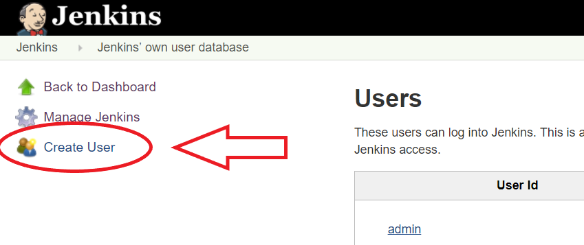
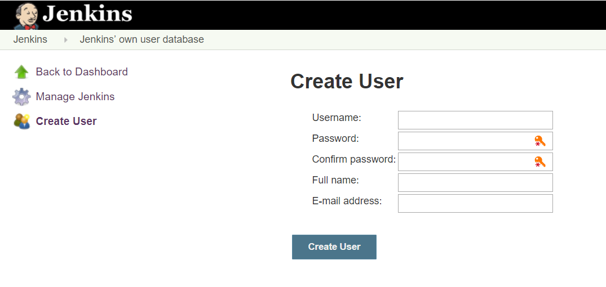
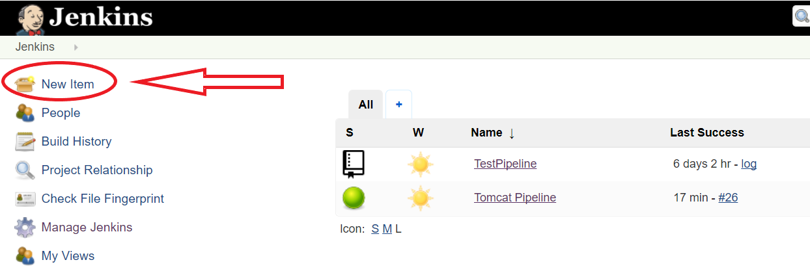

# Setting up a Jenkins-Server and creating a Jenkins-Maven-Pipeline for Tomcat 6.0.53

The purpose of this document is to guide you through the installation of a Jenkins-Server and the creation of a Maven Pipeline.
The Maven Pipeline pulls a repository, which contains a Tomcat-Server vers. 6.0.53, from GitHub.com, builds and tests it's code and finally deploys the created JAR-file to a specified directory.

## Installing Jenkins

The following instructions are based on this site: https://pkg.jenkins.io/debian-stable/

1. To use the Debian package repository of Jenkins add it’s key to the system by executing the following command via the terminal: 
```shell
wget -q -O https://pkg.jenkins.io/debian-stable/jenkins.io.key | sudo apt-key add -
```
2. Add the following line to the file “sources.list” which can be found in /etc/apt/: 
>deb https://pkg.jenkins.io/debian-stable binary/
3. Run the command “sudo apt-get update” and then the command “sudo apt-get install jenkins” (in that order)

You should be able to access Jenkins in a web browser now. By typing in:

> http://localhost:8080

Alternatively use the IP-Address and port of the server e.g.:

> http://141.19.142.63:8080

## Getting started

When starting up Jenkins for the first time you will be prompted to enter the initial password. After this you can select the plugins that you want to install.

1. On your system navigate to /var/log/jenkins/ and copy the initial password from jenkins.log
2. Paste the password into the field in the web browser
3. Select plugins to install. Make sure the plugins “Pipeline” and “GitHub” are selected (most of the plugins should already be selected by default)

## Creating A User

When first loging in to Jenkins you used the initial password found in jenkins.log. To avoid having to type in the same long password again the next time you login, you should create another user.

In Jenkins:
1. Go to “Manage Jenkins” > “Manage Users”


2. Fill in the input fields
3. Click “Create User”





## Configure Maven-Tool and JDK

Maven does not come with Jenkins by default. **Note that the following steps are not the only solution.**

In Jenkins:
Got to “Manage Jenkins” > “Global Tool Configuration”


1. Maven
   1. Scroll down to section “Maven”
   2. Click on “Add Maven”
   3. Type in name for Maven tool and select “Install automatically” and version.
   4. Click “Apply” and “Save”
   
   
   
2. JDK
   1. Scroll down to section “JDK”
   2. Click on “Add JDK”
   3. Type in name for JDK and select “Install automatically” and version.
   4. Click “Apply” and “Save”
   
   

## Configuring GitHub for Jenkins

In Jenkins:
Got to “Manage Jenkins” > “Configure System”


1. Scroll down to section “GitHub” and click “Add GitHub Server”
2. Enter a Name and add credentials
   1. Make sure to set “Kind“ to ”Secret” Text. Here you should paste a token which you can generate here: https://github.com/settings/tokens into the field “Secret”
   
   
   
3. Click “Apply” and “Save”

## Creating a Jenkins Pipeline for Tomcat 6.0.53 via Maven

1. Go to “New Item”



2. Click on “Pipeline”, enter a pipeline name and click on “OK”


3. Enter a Description and set the maximum amount of builds, which should be kept. This should be done in order to not waste memory


4. Check the box for "GitHub Project", enter URL of the repository. Under Build Triggers check "GitHub hook trigger for GITScm polling" and "Poll SCM" and enter "*/5 * * * *" in the text-area "Schedule"


5. Under "Pipeline" chose the definition "Pipeline script from SCM" and make sure "SCM" is set to "Git". Enter the Repository-URL and specify the branch.


6. Click “Apply” and “Save”

## Adding Plugins for FindBugs, Checkstyle and Emma

#### What is FindBugs?

This is what Wikipedia has to say about FindBugs ([Website](http://findbugs.sourceforge.net/)):

>"FindBugs is an open source static code analyser created by Bill Pugh and David Hovemeyer which detects possible bugs in Java programs. The analyzer got itself a successor: SpotBugs. Potential errors are classified in four ranks: (i) scariest, (ii) scary, (iii) troubling and (iv) of concern. "[Wikipedia](https://en.wikipedia.org/wiki/FindBugs, 22.11.2017 10:14 PM]


#### What is Checkstyle?

This is what the official [Website](http://checkstyle.sourceforge.net/) for Checkstyle says:

>"Checkstyle is a development tool to help programmers write Java code that adheres to a coding standard. It automates the process of checking Java code to spare humans of this boring (but important) task. This makes it ideal for projects that want to enforce a coding standard."[Checkstyle.sourceforge.net](http://checkstyle.sourceforge.net/), 22.11.2017 10:07 PM, Section "Overview"]

#### What is Emma?

This is what the official [Website](http://emma.sourceforge.net/) for Emma says:

>"EMMA is an open-source toolkit for measuring and reporting Java code coverage. EMMA distinguishes itself from other tools by going after a unique feature combination: support for large-scale enterprise software development while keeping individual developer's work fast and iterative."[emma.sourceforge.net](http://emma.sourceforge.net/), 22.11.2017 10:10 PM, Section "Code coverage for free: a basic freedom?"]


Go to "Manage Jenkins" > "Manage Plugins"


1. Click on the "Available" Tab and type in the names of the Three plugins: [FindBugs Plug-in](https://wiki.jenkins.io/display/JENKINS/FindBugs+Plugin), [Checkstyle Plug-in](https://wiki.jenkins.io/display/JENKINS/Checkstyle+Plugin) and [Emma plugin](https://wiki.jenkins.io/display/JENKINS/Emma+Plugin). Select the checkboxes of the plugins and click "Download now and install after restart".


2. **In the Tomcat sourcefolder:** add the following plugins inside the tags for "report" > "plugins"


## Creating Jenkinsfile for Tomcat 6.0.53

This is the heart of this exercise. The Jenkinsfile is one way of defining a Jenkins Pipeline. Here you define different stages through which your project will be built, tested and deployed. The Jenkinsfile has to be located in your project’s repository (the root directory should do).

In the GitHub-Repository:
1. Create Jenkinsfile
2. Use the following structure:


“pipeline” - All valid Declarative Pipelines must be enclosed within a “pipeline” block.

“agent” - The agent section specifies where the entire Pipeline, or a specific stage will execute in the Jenkins environment depending on where the agent section is placed.

“triggers” - Here one can specify a trigger for polling. The value for pollSCM stands for a poll for changes every 5 minutes.

“tools” - This is a section for the defining of tools to auto-install and put on the PATH. Note that these tools must be pre-configured manually in “Manage Jenkins” -> “Global Tool Configuration”

“stages”/”stage” - All the relevant work done by a Pipeline will be wrapped in one or more stage directives

“steps” - Steps are wrapped in stages and they take a block of Scripted Pipeline.

“post” - Defines action which will be run at the end of the Pipeline run or stage

This Jenkinsfile is devided into four stages: "Build", "Test", "Reports" and "Deploy". When executing the pipeline Jenkins runs through all these four stages sequetially.
During the building stage we tell Jenkins to first compile and then build the code via Maven. Should these steps succeed the created JAR-file will be archived in the "target" folder. In the test stage we tell Jenkins to run the tests via Maven. After that and in the reports stage we let Jenkins run the FindBugs and CheckStyle Plugins. We also make Jenkins publish the reports to the builds main page.
The last stage is for deploying the created JAR-File to a specific location. In our example it's a folder "TomcatJars" which we created in the working directory of Jenkins under Linux (/var/lib/jenkins/).
 

## Building a Jenkins Job
If the Jenkins Job was configured correctly you should witness the first build. You can monitor the
success of your builds on the dashboard (starting page) or by clicking on the builds you would like to
have a closer look at.


